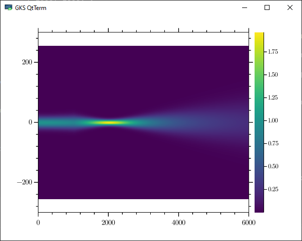

# Transmission of a Gaussian Beam through a Lens
7-01-2021
### About:
Exploration of Julia 1.6.1 for simple optical simulations
- Using FFTW v1.4.3 and GLMakie v0.4.2
- Platform: Windows 10 Pro

### VS Code:
- Navigate to the <code>"GaussianBeamLens"</code> folder, Right-click > Open with VS Code
- Start a Julia REPL with <code> ALT + J + O </code> or <code> Option + J + O </code> in Mac
- Create a Julia environment for the scripts in this folder as follows:\
  Go to the package manager from Julia REPL with <code>]</code>, then \
    <code>(@v1.6) pkg> activate .</code> \
    <code>(@v1.6) pkg> add GLMakie, FFTW </code>\
    <code>(@v1.6) pkg> status </code>-- this should show only two packages, <code>GLMakie </code> and <code>FFTW</code>\
  Note that <code>Manifest.toml</code> and <code>Project.toml</code> are generated in this folder after the above steps

### Verdict:
  - The interactive plot generated with <code>GLMakie</code> is nice. However, I've found that it takes a long time not only to initialize <code>GLMakie</code>, but once it's precompiled, the code itself takes a considerable amount of time to generate the output (2 minutes+ on my machine). Even the simple <code>Test_GLMakie_Plots.jl</code> took 2+ minutes.\
  <code> GaussianBeamLens + GLMakie heatmap + GLMakie labelslidergrid! </code>\
  <code> 3.239748 seconds (4.75 M allocations: 441.220 MiB, 4.99% gc time, 17.12% compilation time) </code>\
  <code> 59.421104 seconds (92.34 M allocations: 5.453 GiB, 4.02% gc time, 65.05% compilation time) </code>\
  <code> 9.986559 seconds (17.61 M allocations: 1.021 GiB, 4.72% gc time, 99.67% compilation time) </code>

  - Since this code only needs to run once, the performance benefit of re-running it (numbers below) is practically irrelevant.\
  <code> 0.463848 seconds (258.34 k allocations: 157.616 MiB, 7.76% gc time, 28.38% compilation time)</code>\
  <code> 0.125093 seconds (158.68 k allocations: 11.320 MiB, 26.83% gc time)</code>\
  <code> 0.237762 seconds (448.46 k allocations: 26.290 MiB, 94.47% compilation time)</code></code>\

  - Hopefully, <code>GLMakie</code> and the overall visualization landscape in Julia will improve in the future, thereby making a switch to Julia from MATLAB/Python/Mathematica for these types of tasks more compelling. 
#### rc

### Updated timings after some optimization by @mkitti

#### Loading core functionality
```julia
julia> @time using GaussianBeamLens
  0.376621 seconds (368.81 k allocations: 40.561 MiB, 0.93% compilation time)

julia> @time GaussianBeamLens.GaussianBeamLensPropagateUncached(0, 25, 1000, 1000);
  0.283066 seconds (832.55 k allocations: 110.724 MiB, 6.95% gc time, 77.52% compilation time)

julia> @time GaussianBeamLens.GaussianBeamLensPropagateUncached(0, 25, 1000, 1000);
  0.063783 seconds (46.21 k allocations: 64.539 MiB, 13.68% gc time)
```

#### Displaying a static image using GR v0.57.3
```julia
julia> @time using GR
  0.106745 seconds (50.41 k allocations: 3.768 MiB)

julia> @time GR.heatmap(GaussianBeamLens.GaussianBeamLensPropagateUncached(0, 25, 1000, 1000))
  3.199314 seconds (4.19 M allocations: 237.825 MiB, 1.40% gc time, 21.84% compilation time)

julia> @time GR.heatmap(GaussianBeamLens.GaussianBeamLensPropagateUncached(0, 25, 1000, 1000))
  0.160951 seconds (3.12 M allocations: 174.922 MiB, 13.37% gc time)

julia> @time GR.heatmap(GaussianBeamLens.z, GaussianBeamLens.x, GaussianBeamLens.GaussianBeamLensPropagateUncached(0, 25, 1000, 1000)')
  2.803033 seconds (5.90 M allocations: 188.710 MiB, 0.96% gc time, 6.35% compilation time)

julia> @time GR.heatmap(GaussianBeamLens.z, GaussianBeamLens.x, GaussianBeamLens.GaussianBeamLensPropagateUncached(0, 25, 1000, 1000)')
  3.518419 seconds (7.33 M allocations: 273.173 MiB, 1.21% gc time, 25.10% compilation time)

julia> @time GR.heatmap(GaussianBeamLens.z, GaussianBeamLens.x, GaussianBeamLens.GaussianBeamLensPropagateUncached(0, 25, 1000, 1000)')
  0.302649 seconds (5.58 M allocations: 170.225 MiB, 6.66% gc time)
```



#### Interactive simulation using GtkReactive.jl
```julia
julia> @time include("src/GtkGUI.jl")
  7.177190 seconds (17.21 M allocations: 1.096 GiB, 6.74% gc time, 0.04% compilation time)
Main.GtkGUI

julia> @time using .GtkGUI
  0.000004 seconds (19 allocations: 1.203 KiB, 55445.45% compilation time)

julia> @time gui()
  1.769222 seconds (2.44 M allocations: 208.761 MiB, 2.90% gc time, 86.39% compilation time)
```


### Interactive simulation using GLMakie.jl

```julia
julia> include("GLMakie_GaussianBeamLens.jl")
  1.519261 seconds (6.40 M allocations: 433.387 MiB, 6.65% gc time, 4.79% compilation time) # @lift
 34.037748 seconds (94.64 M allocations: 5.542 GiB, 4.08% gc time, 64.77% compilation time) # heatmap
  5.783349 seconds (17.83 M allocations: 1.035 GiB, 4.66% gc time, 99.59% compilation time) # labelslidergrid!
```


### Pluto with GR


See a [static HTML version](https://mkitti.github.io/GaussianBeamLens/images/Pluto_with_GR.jl.html) of the [notebook](notebooks/Pluto_with_GR.jl).

PC: D13
