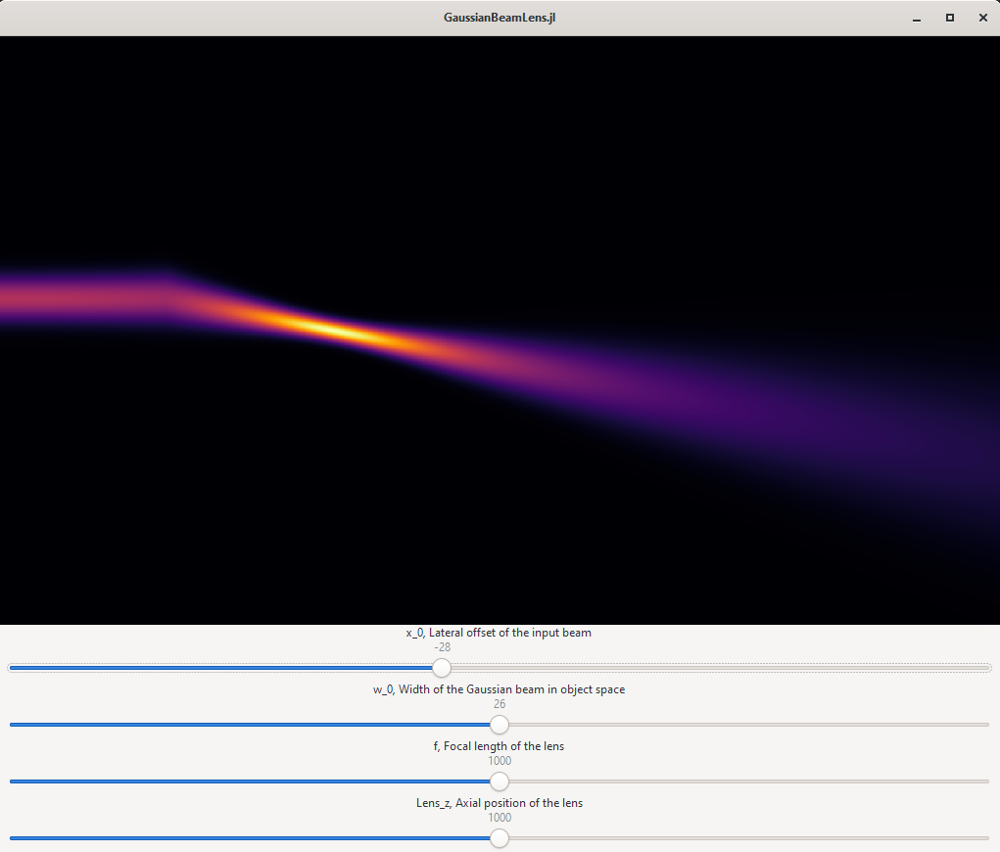

# Introduction

The Julia Language is an open source general purpose programming language with an emphasis on numerical processing (https://julialang.org/).

---

# Compilation

Julia is a compiled language. In typical usage, there is not a discrete compilation step. Julia compiles functions as you call them. It compiles a specialized version of each function for the specific types that you passed.

* Precompilation: Parse code and do type inference
* Just-in-time compilation: Compile code to native machine assembly as you execute the functions (normal mode of operation)
* Ahead-of-time compilation: Compile code to native machine assembly before you execute the functions (today)

---

# The Compiler: LLVM

Originally stood for Low-Level Virtual Machine. Now it's just LLVM

* Main idea: Split compilation into two phases
    * Compile code first to a architecture independent machine readable form (intermediate representation or IR)
    * Compile intermediate representation to native code for a specific processor

---

# Precompilation

Parse code and do type inference. This happens upon package loading.

* You can create `precompile` statements to suggest concrete argument types for methods
* This compiles code to an intermediate binary form
* More information: https://julialang.org/blog/2021/01/precompile_tutorial/

```julia
julia> using GaussianBeamLens
[ Info: Precompiling GaussianBeamLens [270b4de7-9982-4ec9-82b5-5a39cab38fbe]
```

---

# Just-in-time Compilation

Compiles to source code to native code using types. This typically happens as you execute functions.

```julia
julia> function f(a, b)
           return a + 2b
       end
f (generic function with 1 method)

julia> f(3, 5)
13
```

---

# Just-in-time Compilation

## Lowering: `@code_lowered`

Parse your source code into a standard form.


```julia
julia> @code_lowered f(3, 5)
CodeInfo(
1 ─ %1 = 2 * b
│   %2 = a + %1
└──      return %2
)
```

---

## `@code_typed`: Figure out the machine types of all variables 

```julia
julia> @code_typed f(3,5)
CodeInfo(
1 ─ %1 = Base.mul_int(2, b)::Int64
│   %2 = Base.add_int(a, %1)::Int64
└──      return %2
) => Int64
```

---

## `@code_warntype`: Analyze and highlight any amibiguities

```julia
julia> @code_warntype f(3, 5)
MethodInstance for f(::Int64, ::Int64)
  from f(a, b) in Main at REPL[7]:1
Arguments
  #self#::Core.Const(f)
  a::Int64
  b::Int64
Body::Int64
1 ─ %1 = (2 * b)::Int64
│   %2 = (a + %1)::Int64
└──      return %2
```

---

## `@code_llvm`: Compile to architecture independent form

```julia
julia> @code_llvm f(3,5)
;  @ REPL[7]:1 within `f`
; Function Attrs: uwtable
define i64 @julia_f_1451(i64 signext %0, i64 signext %1) #0 {
top:
;  @ REPL[7]:2 within `f`
; ┌ @ int.jl:88 within `*`
   %2 = shl i64 %1, 1
; └
; ┌ @ int.jl:87 within `+`
   %3 = add i64 %2, %0
; └
  ret i64 %3
}
```

---

## `@code_native`: Compile for your specific processor

```julia
julia> function f(a, b)
           return a + 2b
       end
f (generic function with 1 method)

julia> f(3, 5)
13

julia> @code_native f(3, 5)
        .text
; ┌ @ REPL[7]:1 within `f`
        pushq   %rbp
        movq    %rsp, %rbp
; │ @ REPL[7]:2 within `f`
; │┌ @ int.jl:87 within `+`
        leaq    (%rcx,%rdx,2), %rax
; │└
        popq    %rbp
        retq
        nopw    (%rax,%rax)
; └
```

---

# Ahead-of-time compilation

* PackageCompiler.jl ( https://github.com/JuliaLang/PackageCompiler.jl )
* Julia still needs to infer the types.
* Typically, infer the types from an example execution
* Creates a shared library (.dll, .so) to replace the standard Julia system image

---

# Demonstration: GaussianBeamLens

Repository: https://github.com/mkitti/GaussianBeamLens

Thin lens beam propagation simulation



---

# Other Compilation

* GPUCompiler.jl: https://github.com/JuliaGPU/GPUCompiler.jl
* StaticCompiler.jl: https://github.com/tshort/StaticCompiler.jl
* julia-wasm: https://github.com/Keno/julia-wasm

---

# Wishlist

* Faster compilation
* Smaller binaries
* Better linking of smaller files
